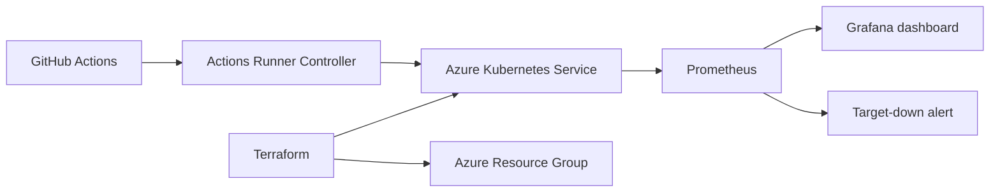
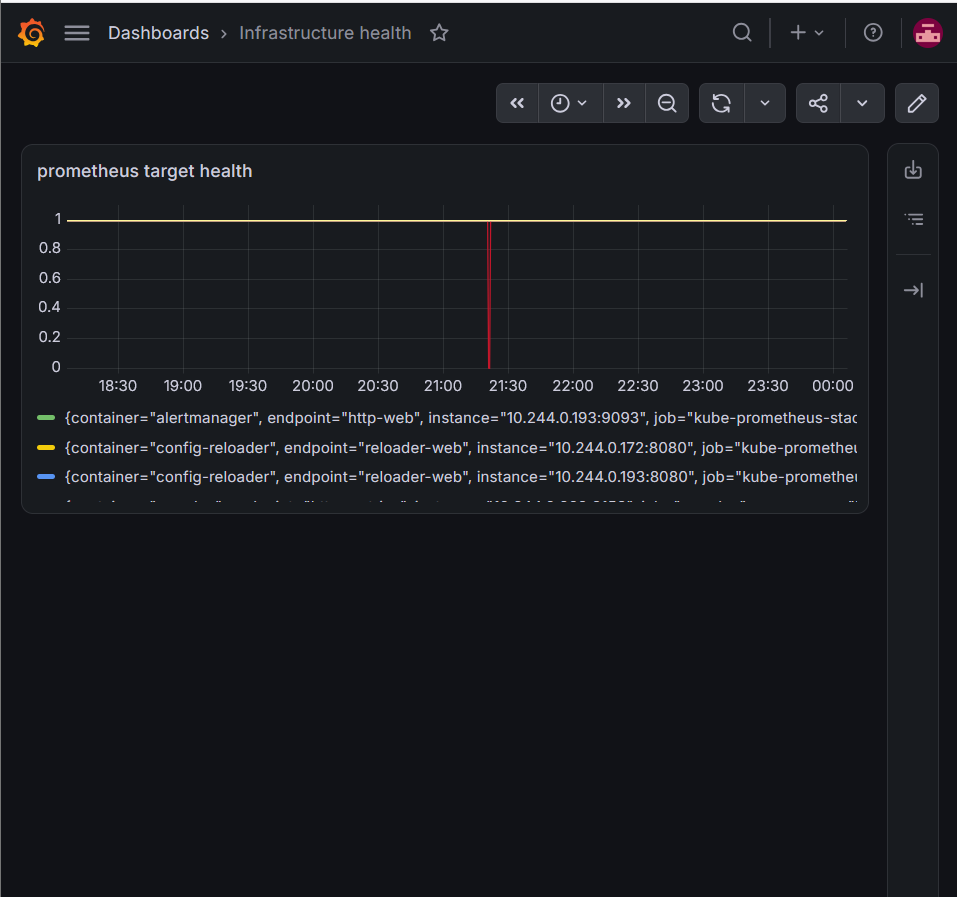
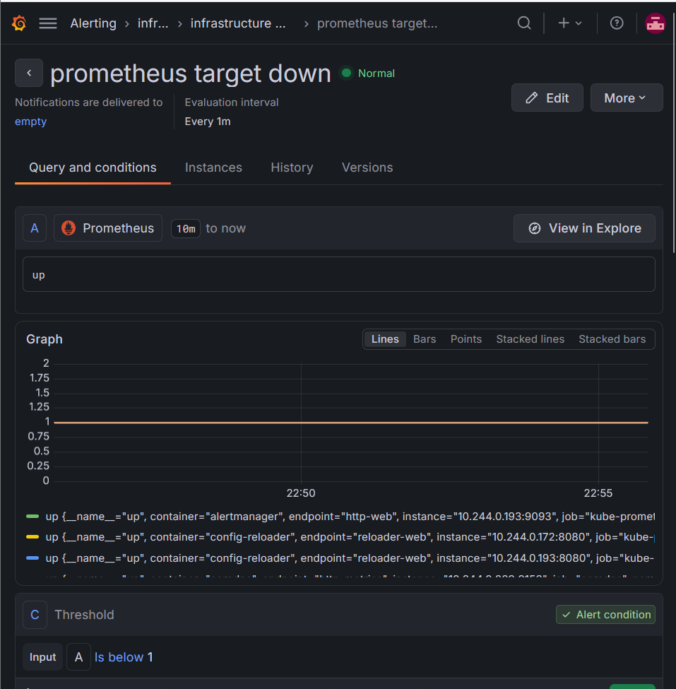

# Azure Kubernetes GitHub Actions Runners

Portfolio project showing how I provisioned an Azure Kubernetes Service (AKS) environment, prepared it for Actions Runner Controller (ARC), and added Prometheus/Grafana observability.

## Why I built it

This project demonstrates four Cloud Engineer skills:

1. **AKS provisioning with Terraform** — I used infrastructure as code so the cluster can be recreated consistently instead of configured manually.
2. **Self-hosted GitHub Actions runners on Kubernetes** — I prepared a path for running CI workloads on controlled, scalable infrastructure rather than relying only on GitHub-hosted runners.
3. **Prometheus and Grafana monitoring** — I added visibility into cluster and runner health so operations are measurable, not guesswork.
4. **Alerting and verification** — I created a target-health dashboard and a `Prometheus Target Down` alert so a failed scrape can become an actionable operational signal.

## Architecture



## Repository layout

```text
infra/                  Terraform provider, AKS, variables, outputs
k8s/                    ARC and runner Kubernetes manifests
k8s/monitoring/         Prometheus/Grafana values
verify/                 Validation checklist
docs/screenshots/       Portfolio evidence captured from the running stack
```

## What I implemented

### 1. Provisioned AKS with Terraform

`infra/main.tf` creates an Azure resource group and a system-assigned-identity AKS cluster. Keeping the cluster definition in Terraform makes the environment repeatable and reviewable.

### 2. Prepared Kubernetes runner infrastructure

The `k8s/` directory is the integration point for ARC, runner scale sets, namespaces, and runner permissions. The next implementation step is to populate the ARC values and runner deployment manifests with the repository’s intended GitHub organization or repository scope.

### 3. Added observability

`k8s/monitoring/values.yaml` configures Prometheus retention and Grafana resource requests. In Grafana, the **Infrastructure Health** dashboard uses Prometheus’ `up` metric to show whether scraped targets—including Grafana, CoreDNS, Prometheus, and exporter endpoints—are healthy.

### 4. Added an operational alert

The **Prometheus Target Down** rule evaluates the `up` metric and triggers when a target is below `1`. It uses a five-minute pending period and a one-minute evaluation interval to reduce noise from short-lived scrape failures.

## Validation evidence

Add screenshots captured from the running environment to `docs/screenshots/` and keep the filenames below stable:





Recommended evidence to capture:

- AKS resources created by Terraform
- Healthy Grafana **Infrastructure Health** dashboard
- Alert rule showing `up < 1`, five-minute pending period, and one-minute evaluation interval
- Successful runner registration or a GitHub Actions job executing on the self-hosted runner

## Lessons learned

- Infrastructure as code makes cloud environments reproducible.
- Kubernetes adds operational power, but also requires deliberate monitoring and alerting.
- A dashboard explains current state; an alert creates an operational response path.
- Portfolio documentation should show both implementation decisions and evidence that the system works.
